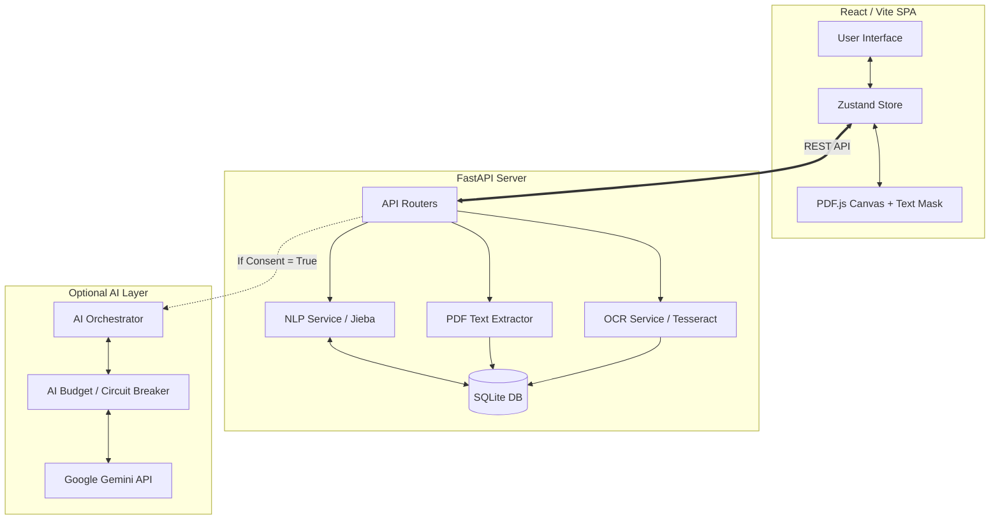

# Hanora Architecture

Hanora follows a **Local-First, Offline-Capable MVP Architecture** with an optional AI enrichment layer.

## Core Principles
1. **Source of Truth**: The local SQLite database (`hanora.sqlite3`) via FastAPI is the ultimate source of truth.
2. **Frontend Hydration**: The React/Vite frontend hydrates its state from backend APIs. `localStorage` is only used for lightweight preferences and UI state.
3. **Optional AI**: Google Gemini is an enrichment layer. The core dictionary, tokenization, and spaced repetition (SRS) features must work 100% offline without API keys.
4. **Strict Consent**: User data (highlights, sentences, page context) is NEVER sent to AI unless explicit consent is toggled on via `/api/ai/consent`.

## System Diagram



## Data Flow (PDF Upload And OCR Mask)
1. User uploads a PDF through Dashboard or Reader.
2. `POST /api/documents/upload` stores the original file under `backend/data/uploads`.
3. Backend extracts text page by page:
   - native PDF text first;
   - OCR fallback through Poppler/pdf2image and Tesseract when no text layer is available.
4. `documents.content` stores page text joined with form-feed (`\f`).
5. `pages` rows are replaced with one row per extracted/OCR page.
6. Reader renders the PDF with PDF.js.
7. For each rendered page:
   - if PDF.js returns native text, the native text layer is used for selection;
   - if native text is empty and OCR text exists, an invisible OCR mask is rendered over the canvas.
8. User selection is mapped to page number, bbox ratio, source sentence, paragraph context, and page context.

`POST /api/documents/{document_id}/ocr` refreshes extraction for an already-stored PDF. This is used when OCR dependencies are installed after upload or when a scanned PDF initially had empty content.

## Data Flow (Highlight & Analyze)
1. User highlights text in PDF or Text reader.
2. Frontend sends `selected_text`, `source_sentence`, `paragraph_context`, and `page_context` to `/api/nlp/analyze`.
3. Backend NLP parses text using local dictionary, HSK, phrase, and Trung-Việt enriched data, returning deterministic definitions.
4. UI displays dictionary fallback clearly when no AI-natural translation exists.
5. If AI consent is ON, the AI orchestrator may send allowed context to Gemini to extract natural translation, domain-specific meaning, and grammar notes.
6. The combined result is returned to the frontend.

## Data Flow (Sentence / Paragraph / Context Translation)
1. Reader sidebar exposes three scopes: `Dịch câu`, `Dịch đoạn`, and `Context`.
2. Frontend calls `POST /api/nlp/translate-context` with `scope`.
3. Backend returns separate `selection`, `sentence`, `paragraph`, `context`, and `grammar` blocks.
4. The UI keeps sentence, paragraph, and context results distinct so users do not confuse word-level dictionary fallback with natural sentence translation.

## Floating AI Chat
The AI chat is a floating widget in Reader, not a fixed sidebar tab. It receives the current selection and nearby context from the Reader controller. It calls `/api/ai/chat`, which is consent/config gated. If AI is unavailable, the UI shows configuration/consent status and local fallback messaging.

## Database Schema (SQLite)
- `users`: Local user profile, preferences, AI consent.
- `documents`: Uploaded reading materials.
- `pages`: Page-level text extracted from native PDF text or OCR.
- `saved_words`: User's vocabulary flashcards with SRS metadata (intervals, next review date).
- `annotations`: Contextual highlights linked to specific documents and bounding boxes.
- `hanora_dictionary`: The 150k+ entry offline dictionary (CC-CEDICT + HSK).

## Release Data Bootstrap
Raw import data lives in `data/raw/` and is imported through `backend/scripts/bootstrap_data.py`.

```text
data/raw/cedict/cedict_ts.u8
data/raw/hsk/*.csv
data/raw/phrase/*.csv
data/raw/TrungViet/TrungViet/star_trungviet.*
```

The SQLite database can be regenerated from these raw files plus Alembic migrations. A local DB changed by test uploads is not a release source of truth.
