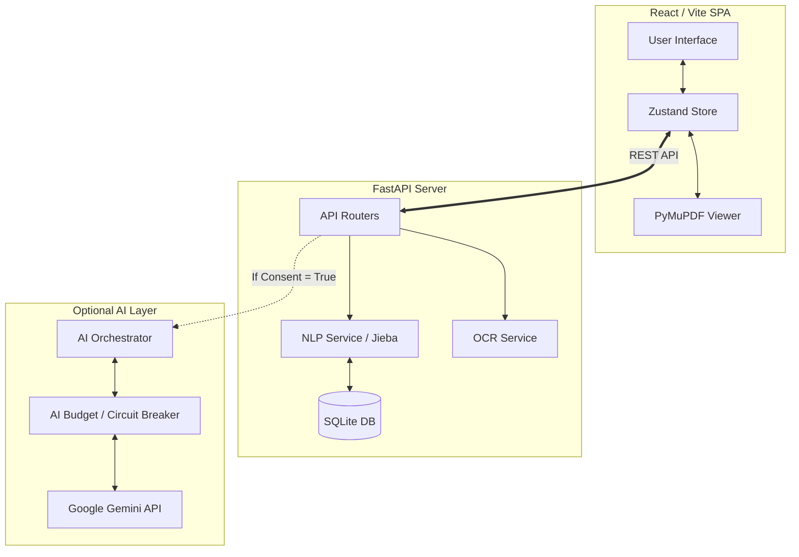

# Hanora Architecture

Hanora follows a **Local-First, Offline-Capable MVP Architecture** with an optional AI enrichment layer.

## Core Principles
1. **Source of Truth**: The local SQLite database (`hanora.sqlite3`) via FastAPI is the ultimate source of truth.
2. **Frontend Hydration**: The React/Vite frontend hydrates its state from backend APIs. `localStorage` is only used for lightweight preferences and UI state.
3. **Optional AI**: Google Gemini is an enrichment layer. The core dictionary, tokenization, and spaced repetition (SRS) features must work 100% offline without API keys.
4. **Strict Consent**: User data (highlights, sentences, page context) is NEVER sent to AI unless explicit consent is toggled on via `/api/ai/consent`.

## System Diagram

## Data Flow (Highlight & Analyze)
1. User highlights text in PDF or Text reader.
2. Frontend sends `selected_text` and `source_sentence` to `/api/nlp/analyze`.
3. Backend NLP parses text using local CC-CEDICT and HSK databases, returning deterministic definitions.
4. If AI Consent is ON, the `AI Orchestrator` sends the context to Gemini to extract domain-specific meaning and grammar patterns.
5. The combined result (Rule-based + AI) is returned to the frontend.

## Database Schema (SQLite)
- `users`: Local user profile, preferences, AI consent.
- `documents`: Uploaded reading materials.
- `saved_words`: User's vocabulary flashcards with SRS metadata (intervals, next review date).
- `annotations`: Contextual highlights linked to specific documents and bounding boxes.
- `hanora_dictionary`: The 150k+ entry offline dictionary (CC-CEDICT + HSK).
